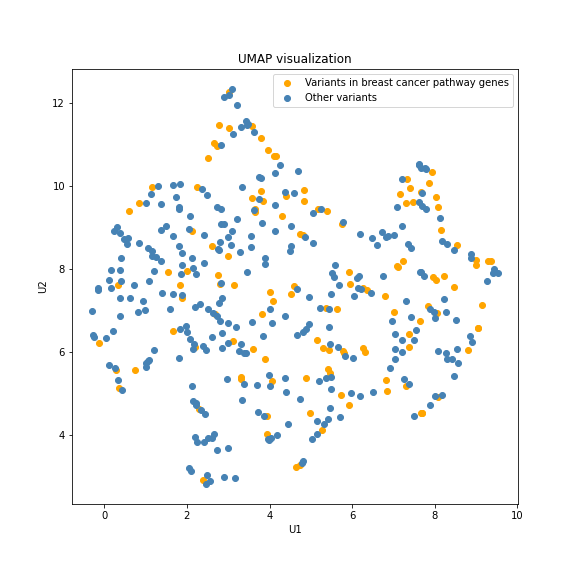

# Learning embeddings of cancer germline variants

This repository contains code and results for a representation learning approach to embed cancer germline variants.
The models are implemented using PyTorch and the [Transformers](https://huggingface.co/docs/transformers/index) and [SentenceTransformer](https://www.sbert.net/) packages in Python 3.10.
The processed data is available on request to reproduce the training and embeddings presented here.

## Data

The training scheme relies is based on the workflow of a denoising autoencoder. The model uses a pretrained DNABERT model as encoder, and a shallow BERT decoder initialized from scratch.

The stacked model is trained to "denoise" genetic mutations and reconstruct the local reference genome. The data used for this training is derived from the [ClinVar](https://www.ncbi.nlm.nih.gov/clinvar/) database. 
The "variants_summary" was downloaded on 06/02/2023, and filtered to consider only Single Nucleotide Variants (SNVs). As the single base sostitutions include very limited informations, the Python package [pyfadix](https://pypi.org/project/pyfaidx/) was used to extract the local genomic context and map a window that spans 15 bps centered at the mutation.

The embeddings made available are produced using data from the [Catalogue Of Germline Variants In Cancer](http://www.cogvic.vip/) (COGVIC), a comprehensive database of germline pathogenic variants in East Asian pan-cancer patients. The dataset was filtered to consider only SNVs and stopgain mutations, for which local genomic contexts were extracted as for the previous case.

## Model

To train a suitable encoder for germline SNVs, we require a valid trained objective. 
The architecture adopted is derived from the Transformers and Sequential Denoising Auto-Encoder (TSDAE) model, which is adapted to the task of encoding DNA sequences.

This architecture requires an encoder module, to produce a latent representation of a DNA sequence. This encoder is initialized using a pretrained DNABERT-3 model, which tokenizes an input genomic sequence into 3-mers, and learns embeddings for each 3-mer. 
The decoder module is composed of a shallow BERT architecture with only two hidden layers. 

A schematic representation of the model is shown in the following image:

The training objective is the "denoising" of mutated sequences to reconstruct the original reference genome in the local window. 

The final model uses a latent dimension for the mutation embeddings of 768, and was trained for 500 epochs of 50 batches each. Each batch includes 128 samples from the ClinVar dataset.

## Catalogue Of Germline Variants In Cancer (COGVIC) Embeddings

The model trained on the ClinVar dataset is used to embed SNVs and stopgain point mutations from the COGVIC database. The results, available in the file "COGVIC_germline_variants_embeddings.csv", are also displayed in the following UMAP plot:

## Availability

The code to train from scratch a TSDAE-like model for DNA sequences is available in the "train_sentence_transformer.py" script.  
The trained model and the pre-processed data are available on reasonable request. 

## Funding

This project has received funding from the European Union's Framework Programme for Research and Innovation Horizon 2020 (2014-2020) under the Marie Skłodowska-Curie Grant Agreement No. 813533-MSCA-ITN-2018 

## References

1. Reimers, Nils, and Iryna Gurevych. "Sentence-bert: Sentence embeddings using siamese bert-networks." arXiv preprint arXiv:1908.10084 (2019).

2. Ji, Yanrong, et al. "DNABERT: pre-trained Bidirectional Encoder Representations from Transformers model for DNA-language in genome." Bioinformatics 37.15 (2021): 2112-2120.

3. Landrum, Melissa J., et al. "ClinVar: improving access to variant interpretations and supporting evidence." Nucleic acids research 46.D1 (2018): D1062-D1067.

4. Shirley, Matthew D., et al. Efficient" pythonic" access to FASTA files using pyfaidx. No. e1196. PeerJ PrePrints, 2015.

5. Wang, Kexin, Nils Reimers, and Iryna Gurevych. "Tsdae: Using transformer-based sequential denoising auto-encoder for unsupervised sentence embedding learning." arXiv preprint arXiv:2104.06979 (2021).
